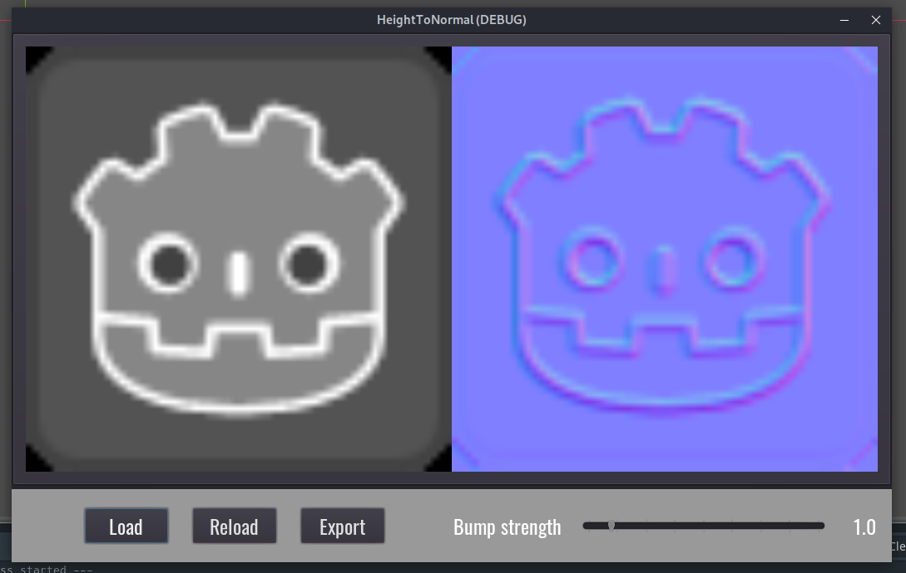

# HeightToNormal

## What is this?

Small GUI utility made with the [Godot Game Engine](https://godotengine.org/). Loads an image as a heightmap and converts it to a normalmap. Assumes that the height data is defined in the image's luminance.

## How to use

The *Load* button opens a file picker to choose the input image, which will be displayed in b/w luminance values to represent what the normalmap is actually based on, and the output normalmap is immediately generated. You can then tune the bump strength from 0 to 10 with the slider and finally export the resulting normalmap with the *Export* button. 
The *Reload* button allows you to reload the previously opened heightmap, for example after editing it. This will automatically regenerate the normals as well.

## How to install

No installation needed. You can either clone this repo and open it as a Godot project (and then run it from there) or run one of the executables from the Releases section.

## To Do

  * Support more image formats (like JPEG or EXR)
  * Allow user to select a specific color channel from the image as height instead of only using luminance
  * Auto reload height and normals when the input image is changed (without hitting *Reload*)